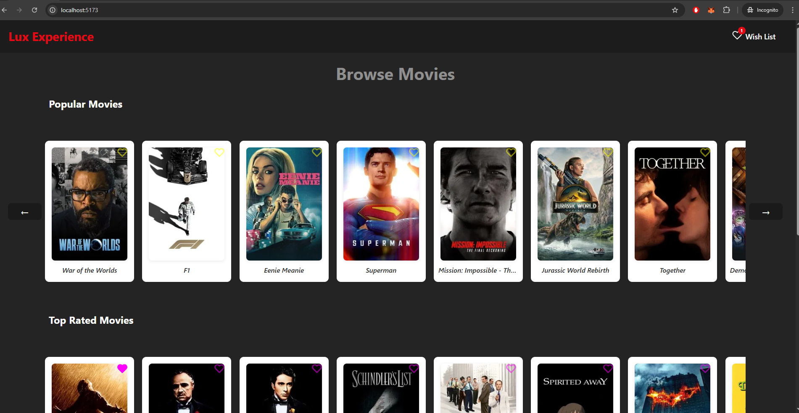
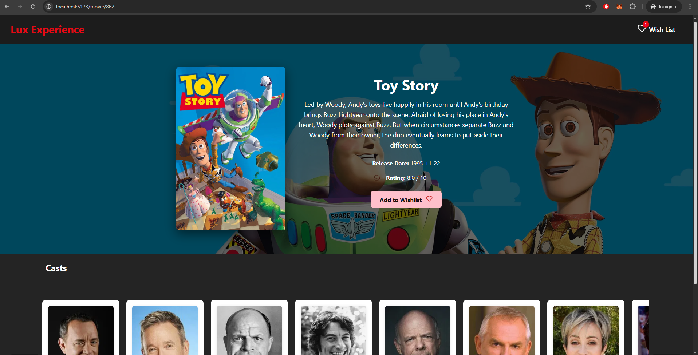
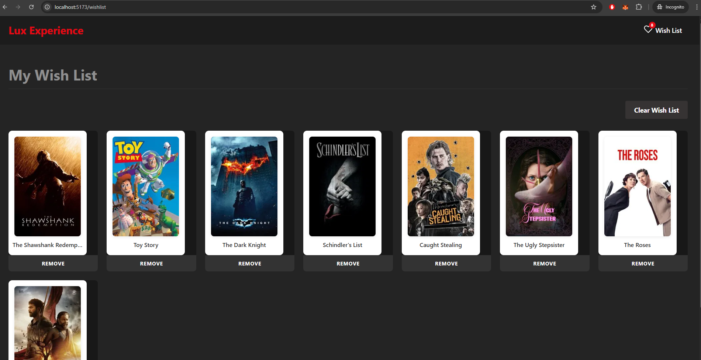

# Lux Experience Challenge

A web application to browse Movies by categories, view movie details, and manage a wish list. Built with React, TypeScript, SCSS, Vite, SSR, Redux, React Query, and TheMovieDatabase API.

---

## Table of Contents

- [Features](#features)
- [Tech Stack](#tech-stack)
- [Project Structure](#project-structure)
- [Setup & Installation](#setup--installation)
- [Running the App (Development)](#running-the-app-development)
- [Building & Running (Production/SSR)](#building--running-productionssr)
- [Environment Variables](#environment-variables)
- [Testing](#testing)
- [Notes](#notes)

---

## Features

- Homepage with 3 carousels, each for a different movie category
- Movie detail page with description, image, and category-specific styles
  - "Add to wish list" functionality
  - "Remove from wish list" functionality
  - "Add clear all wish list" functionality
- Wish list section to view, add, and remove all added movies
- Server-Side Rendering (SSR) support

---

## Tech Stack

- **React** (with TypeScript)
- **Vite** (bundler, SSR)
- **Vitest** (testing)
- **SCSS** (styling)
- **Redux** (state management)
- **React Query** (data fetching)
- **React Router** (routing)
- **TheMovieDatabase API** (movie data)

---

## Project Structure

```
src/
  api/
  components/
  const/
  hooks/
  pages/
  store/
  utils/
  App.tsx
  entry-client.tsx
  entry-server.tsx
  setupTests.ts
  server.js
```

---

## Setup & Installation

1. **Clone the repository:**

   ```cmd
   git clone https://gitfront.io/r/1majek/NybvUKdsaUea/lux-experience-challenge/
   cd lux-experience-challenge
   ```

2. **Install dependencies:**

   ```cmd
   npm install
   ```

3. **Set up environment variables:**
   - Create a `.env` file in the root directory.
   - Add your [TMDB API key](https://www.themoviedb.org/settings/api):
     ```
     VITE_TMDB_API_KEY=your_tmdb_api_key_here
     ```

---

## Running the App (Development)

```cmd
npm run dev
```

- Open [http://localhost:5173](http://localhost:5173) in your browser.

---

## Building & Running (Production/SSR)

1. **Build the client and server bundles:**

   ```cmd
   npm run build
   ```

2. **Start the SSR server:**
   ```cmd
   npm run serve
   ```
   - The app will be available at [http://localhost:4173](http://localhost:4173)

---

## Environment Variables

- `VITE_TMDB_API_KEY` — Your TheMovieDatabase API key.

---

## Testing

- **Run tests:**
  ```cmd
  npm test
  ```

---

## Notes

- **Styling:** All styles are written in SCSS and organized by component.
- **SSR:** The app uses Vite's SSR capabilities. See `entry-server.tsx` and `entry-client.tsx` for details.
- **State Management:** Redux is used for the wish list. React Query handles data fetching and caching.
- **Routing:** React Router is used for navigation between pages.

---

## Useful Scripts

- `npm run dev` — Start development server
- `npm run build` — Build for production (SSR)
- `npm run serve` — Serve the production build (SSR)
- `npm test` — Run tests

---

## Contact

For any questions, please contact majek1@hotmail.com.

## Screenshots




